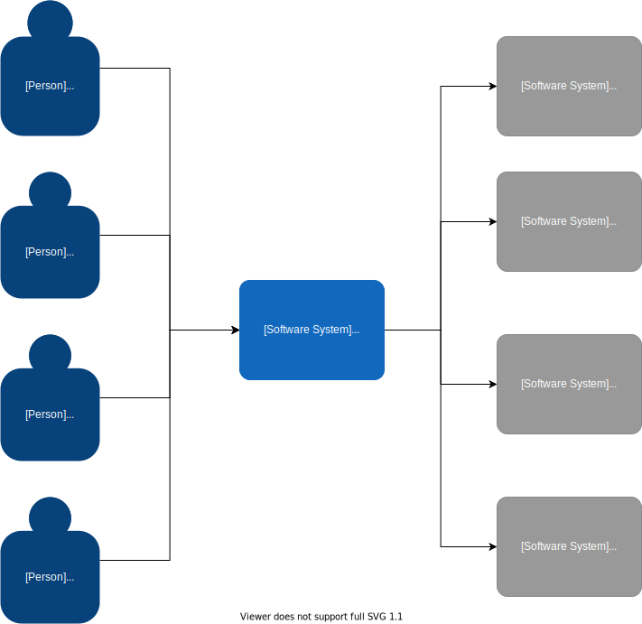
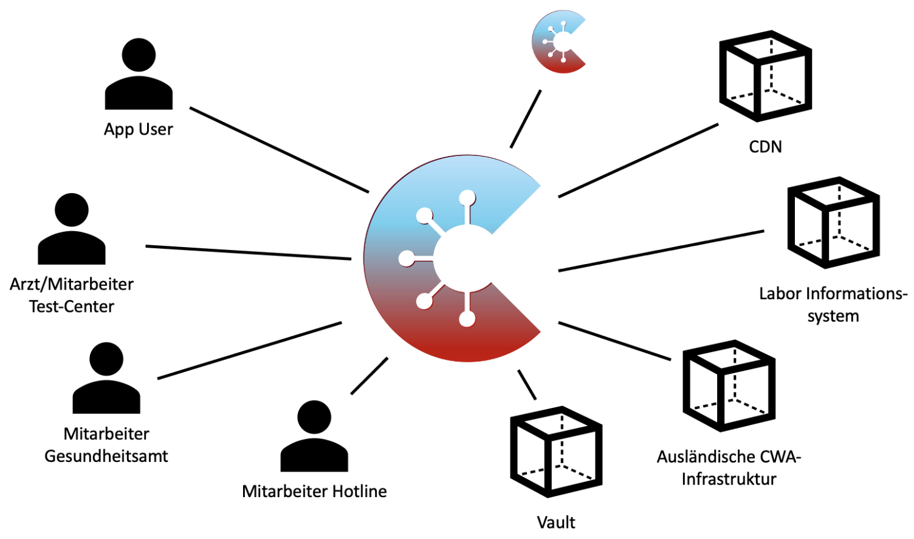

:jbake-title: Architektur-Übersicht
:jbake-type: page_toc
:jbake-status: published

:toc: left

== Mission Statement

> Die Corona-Warn-App ist eine App, die hilft, Infektionsketten des SARS-CoV-2 (COVID-19-Auslöser) in Deutschland nachzuverfolgen und zu unterbrechen. Die App basiert auf Technologien mit einem dezentralisierten Ansatz und informiert Personen, wenn sie mit einer infizierten Person in Kontakt standen. Transparenz ist von entscheidender Bedeutung, um die Bevölkerung zu schützen und die Akzeptanz zu erhöhen.

== Randbedingungen

Rahmenbedingungen sind Vorgaben, die unsere Lösung einschränken und Optionen ausschließen. Man unterscheidet in technologische und organisatorische Rahmenbedingungen.

[options="header",cols="1,2"]
|===
| Technologisch | Organisatorisch

| Betrieb in der Cloud
| Große Medienaufmerksamkeit, gewisse Skepsis am Mehrwert innerhalb der Bevölkerung

| Native mobile Clients
| Konsortium aus zwei Auftragnehmern (SAP und Deutsche Telekom)

| Einsatz der Exposure Notification Framework
| Enger Zeitrahmen

| 
| Hoher politischer Druck, viele Parteien involviert (Ministerien, Behörden, RKI)

| Hohe Datenschutzanforderungen
|===

== Architekturziele

Die Architekturziele sind die wichtigsten geforderten Qualitätsmerkmale für ein Softwaresystem.
Typischerweise werden im Rahmen eines Architekturüberblicks die Top-3 bis Top-5 genannt.

[options="header",cols="1,2"]
|===
| Ziel | Beschreibung

| Sicherheit
| Der Schutz der personenbezogenen Daten hat oberste Priorität, vertrauliche Daten werden dezentral gespeichert.

| Zuverlässigkeit
| Die Anwendung ist jederzeit verfügbar und sie funktioniert auch bei Lastspitzen oder Angriffen auf die Server-Infrastruktur.

| Effizienz
| Dutzende von Millionen Benutzer können die Anwendung einsetzen.

| Benutzbarkeit
| Die Endanwendung ist intuitiv bedienbar und wird von den Anwendern akzeptiert.

| Betreibbarkeit
| Die Installation der Endanwendung kann auch von Laien durchgeführt werden.
|===
 

== Lösungsansätze

Den Architektur-/Qualitätszielen werden mit zugeordneten high-level Lösungsansätze in Beziehung zueinander dargestellt.

[options="header",cols="1,2"]
|===
| Ziel | Passende Lösungsansätze

| Sicherheit
| Speicherung der Daten lokal 

Verschlüsselung aller Bewegungsdaten 

Senden der Daten nur nach Aufforderung

| Zuverlässigkeit
| Microservices

Docker, Kubernetes, Public Cloud

| Effizienz
| Dezentraler Ansatz

Mobile Apps

Wenig Datenverkehr

| Benutzbarkeit
| Transparenz in der Entwicklung, Verwendung von Opensource

Sehr einfache Bedienführung

| Betreibbarkeit
| Apps über den App-Store

Public Cloud Infrastruktur für die Server
|===

== Kontextsicht

Das ist eine Abgrenzung des Systems und Visualisierung der Benutzer und Fremdsysteme, mit denen es interagiert. Typischerweise wird es durch eine Grafik abgebildet, ergänzt um kurze Beschreibungen. Das System selbst ist dabei eine Blackbox.

=== PlantUML

.Kontextüberblick CWA Server
[plantuml]
----
!pragma graphviz_dot jdot
skinparam componentStyle uml2

component [Corona-App-Server] as server
component Vault
component CDN
component "Labor\nInformationssystem" as labor
component "Ausländische\nCWA Infrastruktur" as ausland
actor "App User" as user
actor "Arzt/Mitarbeiter Test-Center" as arzt
actor "Mitarbeiter Gesundheitsamt" as gesundheitsamt
actor "Mitarbeiter Hotline" as hotline

user -down- server
arzt -down- server
gesundheitsamt -down- server
hotline -down- server

Vault -up- server
CDN -up- server
labor -up- server
ausland -up- server
----

=== Draw.io

.Beispiel in draw.io

=== PowerPoint

.Beispiel als exportiertes Image
